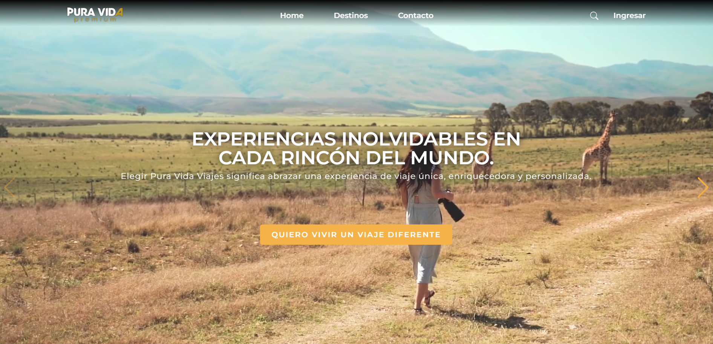

  
  

# **ViajesPuraVidaPremium** | Proyecto Final (Grupal)   
 

# 👨‍💻 Proyecto :
Desarrollamos una aplicación web para la empresa Pura Vida Viajes Premium. Como parte del equipo front end desarrollé la interfaz de la aplicación web para la empresa Pura Vida Viajes Premium que conecta clientes con expertos para planificar su viaje.

Herramientas: 

**Front End:**
  - Html 5
  - Css (Css Modules)
  - JavaScript
  - React
  - Vite
  - Redux toolkit
  - React-admin
  - Material UI

  

**Back End:**
  - NodeJS
  - Express
  - Sequelize
  - Nodemailer
  - Auth0

  

**Data Base:**
  - Postgress

  

**Gestión:**
  - Metología SCRUM
  - Github
  - Trello
  - Slack

      

    

